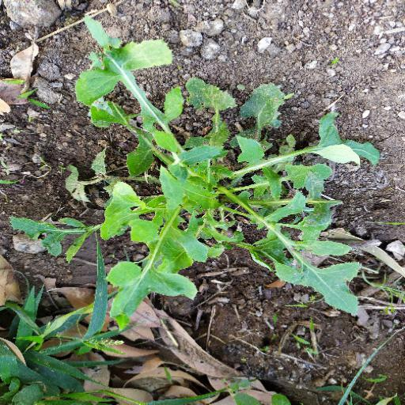
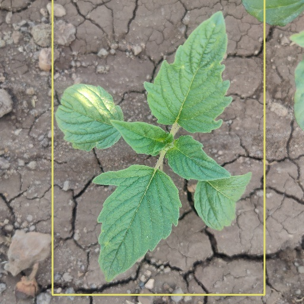
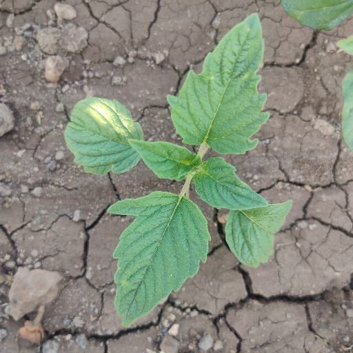
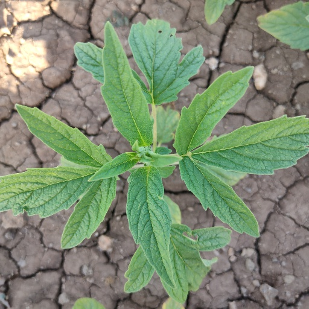
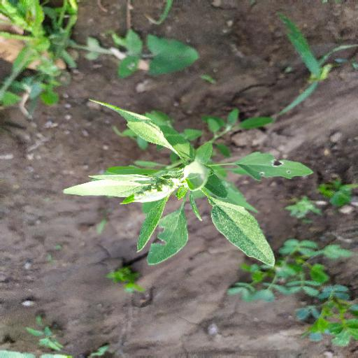
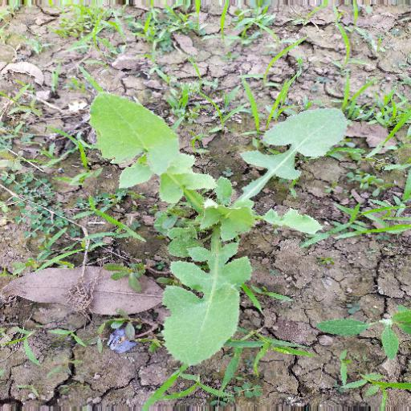

# Crop_and_weed_detection
we made the crop and weed detection model using YOLOV3 on agricultural image data.




# Problem
Weed is unwanted thing in agriculture. Weed use the nutrients, water ,land and many more thihngs that might have gone to crops. Which result less production of required crop. Farmer often use pesticides to remove weed which also affective but some pesticide may stick with crop and may causs problem for humans.

# Data
we using dataset on [kaggle](https://www.kaggle.com/ravirajsinh45/crop-and-weed-detection-data-with-bounding-boxes).
This dataset contains 1300 images of sesame crops and different types of weeds with each image labels.
Each image is a 512 X 512 color image. Labels for images are in YOLO format.
Data on https://www.kaggle.com/ravirajsinh45/crop-and-weed-detection-data-with-bounding-boxes

# Some images
### sesame crop


### 

### weed






  # How to use this repo?

  This Repository is diveded in two parts:

    1. Training 
    2. Detection using pre train model
        - Using openCV (skip installation using requirements.txt file)

- [x] [将YOLO打包为ros 包，能够在ros中直接运行](https://github.com/SUSTech-Gardener/WeedDetection_ros)

## Training(not necessary):

 * Follow the training fold to training


### setting up environment:-

 * Solve the package if you don't have.

   * Now your environment is ready to roar:)

   * For detection you need weights for network. Due to large file i attaching google drive link. You have to download weight file unless you have your own weights file. [click here](https://drive.google.com/open?id=1-Aam2D-fqnwecbeHwa4rtzxtNjwcDkP6)


   * You have to add weights file into `Crop_and_weed_detection > performing_detection > data > weights` folder.

## Performig detection using pre-trained model
### Using OpenCV:-

  * For easy to use.

  * if you have opencv library already installed (opencv included in requirements.txt), skip this step else run below code
    ```
    pip install opencv-python
    ```
  
  then run `detection_opencv.py` to detect, it contains camera or image.
  


If you have any doubts feel free to ask any question at any time:).

 # Thank You:) 


